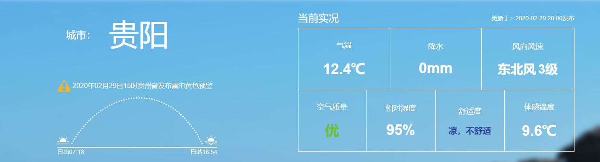
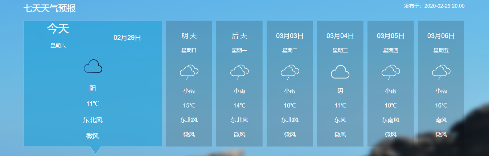
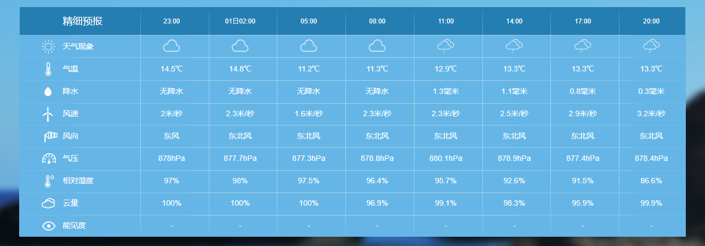

# **pyUnit-weather** [][1]

## 获取中央气象局的天气数据
[](https://pypi.org/project/pyunit-weather/)


### 安装
    pip install pyunit-weather

### 获取能预测天气的城市
    https://github.com/PyUnit/pyunit-weather/blob/master/pyunit_weather/address.txt 


### 获取天气预报
```python
from pyunit_weather import Weather
import pprint


def test():
    weather = Weather()
    w = weather.get_city_weather("贵阳")
    # w = weather.get_county_weather("贵阳")
    pprint.pprint(w)


if __name__ == "__main__":
    test()
```
### json格式





## 返回格式
```json
{"七天天气预报": [{"日期": "今天",
             "星期": "星期六",
             "气象": "阴",
             "温度": "11℃",
             "风向": "东北风",
             "风速": "微风"},
            {"日期": "明 天",
             "星期": "星期日",
             "气象": "小雨",
             "温度": "15℃",
             "风向": "东北风",
             "风速": "微风"},
            {"日期": "后 天",
             "星期": "星期一",
             "气象": "小雨",
             "温度": "14℃",
             "风向": "东北风",
             "风速": "微风"},
            {"日期": "03月03日",
             "星期": "星期二",
             "气象": "小雨",
             "温度": "10℃",
             "风向": "东北风",
             "风速": "微风"},
            {"日期": "03月04日",
             "星期": "星期三",
             "气象": "阴",
             "温度": "11℃",
             "风向": "东风",
             "风速": "微风"},
            {"日期": "03月05日",
             "星期": "星期四",
             "气象": "小雨",
             "温度": "10℃",
             "风向": "东南风",
             "风速": "微风"},
            {"日期": "03月06日",
             "星期": "星期五",
             "气象": "小雨",
             "温度": "16℃",
             "风向": "南风",
             "风速": "微风"}],
 "体感温度": 9.6,
 "发布时间": "2020-02-29 20:00",
 "城市": "贵阳",
 "本市警告": {"发行内容": "贵州省气象台2月29日15时30分发布雷电黄色预警信号：预计未来6小时，省的中部和南部地区将出现雷电天气，其中毕节市东南部、贵阳市南部、安顺市北部、黔南州中部和黔东南州西部雷雨中可能伴有短时强降水、大风、冰雹等强对流天气，请注意防范。",
          "警告": "2020年02月29日15时贵州省发布雷电黄色预警",
          "防御指南": "1.政府及相关部门按照职责做好防雷工作；2.密切关注天气，尽量避免户外活动。"},
 "标题": "贵阳-天气预报",
 "气温": 12.4,
 "温差": -0.6,
 "相对湿度": 95.0,
 "空气压力": 876.0,
 "空气质量指数": 38,
 "精细预报": {"第1天每3个小时预报": [{"云量": "100%",
                          "时间": "23:00",
                          "气压": "878hPa",
                          "气温": "14.5℃",
                          "相对湿度": "97%",
                          "能见度": "-",
                          "降水": "无降水",
                          "风向": "东风",
                          "风速": "2米/秒"},
                         {"云量": "100%",
                          "时间": "01日02:00",
                          "气压": "877.7hPa",
                          "气温": "14.8℃",
                          "相对湿度": "98%",
                          "能见度": "-",
                          "降水": "无降水",
                          "风向": "东北风",
                          "风速": "2.3米/秒"},
                         {"云量": "100%",
                          "时间": "05:00",
                          "气压": "877.3hPa",
                          "气温": "11.2℃",
                          "相对湿度": "97.5%",
                          "能见度": "-",
                          "降水": "无降水",
                          "风向": "东北风",
                          "风速": "1.6米/秒"},
                         {"云量": "96.9%",
                          "时间": "08:00",
                          "气压": "878.8hPa",
                          "气温": "11.3℃",
                          "相对湿度": "96.4%",
                          "能见度": "-",
                          "降水": "无降水",
                          "风向": "东北风",
                          "风速": "2.3米/秒"},
                         {"云量": "99.1%",
                          "时间": "11:00",
                          "气压": "880.1hPa",
                          "气温": "12.9℃",
                          "相对湿度": "95.7%",
                          "能见度": "-",
                          "降水": "1.3毫米",
                          "风向": "东北风",
                          "风速": "2.3米/秒"},
                         {"云量": "98.3%",
                          "时间": "14:00",
                          "气压": "878.9hPa",
                          "气温": "13.3℃",
                          "相对湿度": "92.6%",
                          "能见度": "-",
                          "降水": "1.1毫米",
                          "风向": "东北风",
                          "风速": "2.5米/秒"},
                         {"云量": "95.9%",
                          "时间": "17:00",
                          "气压": "877.4hPa",
                          "气温": "13.3℃",
                          "相对湿度": "91.5%",
                          "能见度": "-",
                          "降水": "0.8毫米",
                          "风向": "东北风",
                          "风速": "2.9米/秒"},
                         {"云量": "99.9%",
                          "时间": "20:00",
                          "气压": "878.4hPa",
                          "气温": "13.3℃",
                          "相对湿度": "86.6%",
                          "能见度": "-",
                          "降水": "0.3毫米",
                          "风向": "东北风",
                          "风速": "3.2米/秒"}],
          "第2天每3个小时预报": [{"云量": "96.9%",
                          "时间": "08:00",
                          "气压": "878.8hPa",
                          "气温": "11.3℃",
                          "相对湿度": "96.4%",
                          "能见度": "-",
                          "降水": "无降水",
                          "风向": "东北风",
                          "风速": "2.3米/秒"},
                         {"云量": "99.1%",
                          "时间": "11:00",
                          "气压": "880.1hPa",
                          "气温": "12.9℃",
                          "相对湿度": "95.7%",
                          "能见度": "-",
                          "降水": "1.3毫米",
                          "风向": "东北风",
                          "风速": "2.3米/秒"},
                         {"云量": "98.3%",
                          "时间": "14:00",
                          "气压": "878.9hPa",
                          "气温": "13.3℃",
                          "相对湿度": "92.6%",
                          "能见度": "-",
                          "降水": "1.1毫米",
                          "风向": "东北风",
                          "风速": "2.5米/秒"},
                         {"云量": "95.9%",
                          "时间": "17:00",
                          "气压": "877.4hPa",
                          "气温": "13.3℃",
                          "相对湿度": "91.5%",
                          "能见度": "-",
                          "降水": "0.8毫米",
                          "风向": "东北风",
                          "风速": "2.9米/秒"},
                         {"云量": "99.9%",
                          "时间": "20:00",
                          "气压": "878.4hPa",
                          "气温": "13.3℃",
                          "相对湿度": "86.6%",
                          "能见度": "-",
                          "降水": "0.3毫米",
                          "风向": "东北风",
                          "风速": "3.2米/秒"},
                         {"云量": "100%",
                          "时间": "23:00",
                          "气压": "879.1hPa",
                          "气温": "13.8℃",
                          "相对湿度": "95.1%",
                          "能见度": "-",
                          "降水": "0.3毫米",
                          "风向": "东风",
                          "风速": "2.5米/秒"},
                         {"云量": "95.9%",
                          "时间": "02日02:00",
                          "气压": "877.6hPa",
                          "气温": "13.3℃",
                          "相对湿度": "95.3%",
                          "能见度": "-",
                          "降水": "0.9毫米",
                          "风向": "东风",
                          "风速": "2米/秒"},
                         {"云量": "95.2%",
                          "时间": "05:00",
                          "气压": "875.6hPa",
                          "气温": "12.2℃",
                          "相对湿度": "95.5%",
                          "能见度": "-",
                          "降水": "0.5毫米",
                          "风向": "东风",
                          "风速": "2.3米/秒"}],
          "第3天每3个小时预报": [{"云量": "99.5%",
                          "时间": "08:00",
                          "气压": "877hPa",
                          "气温": "12℃",
                          "相对湿度": "95.3%",
                          "能见度": "-",
                          "降水": "0.8毫米",
                          "风向": "东风",
                          "风速": "1.9米/秒"},
                         {"云量": "99.8%",
                          "时间": "11:00",
                          "气压": "878.3hPa",
                          "气温": "10.3℃",
                          "相对湿度": "95.1%",
                          "能见度": "-",
                          "降水": "2.4毫米",
                          "风向": "东北风",
                          "风速": "1.9米/秒"},
                         {"云量": "100%",
                          "时间": "14:00",
                          "气压": "877.1hPa",
                          "气温": "11.8℃",
                          "相对湿度": "93.2%",
                          "能见度": "-",
                          "降水": "2.2毫米",
                          "风向": "东北风",
                          "风速": "1.9米/秒"},
                         {"云量": "100%",
                          "时间": "17:00",
                          "气压": "876.1hPa",
                          "气温": "10.8℃",
                          "相对湿度": "88.8%",
                          "能见度": "-",
                          "降水": "2.2毫米",
                          "风向": "东北风",
                          "风速": "3米/秒"},
                         {"云量": "100%",
                          "时间": "20:00",
                          "气压": "876.8hPa",
                          "气温": "10.2℃",
                          "相对湿度": "87.2%",
                          "能见度": "-",
                          "降水": "1.7毫米",
                          "风向": "东北风",
                          "风速": "3.4米/秒"},
                         {"云量": "100%",
                          "时间": "23:00",
                          "气压": "878.7hPa",
                          "气温": "7.9℃",
                          "相对湿度": "96%",
                          "能见度": "-",
                          "降水": "4.1毫米",
                          "风向": "东北风",
                          "风速": "2.5米/秒"},
                         {"云量": "99.7%",
                          "时间": "03日02:00",
                          "气压": "877.5hPa",
                          "气温": "7.3℃",
                          "相对湿度": "93.8%",
                          "能见度": "-",
                          "降水": "1.1毫米",
                          "风向": "北风",
                          "风速": "2.9米/秒"},
                         {"云量": "99.3%",
                          "时间": "05:00",
                          "气压": "877.1hPa",
                          "气温": "7.2℃",
                          "相对湿度": "93.2%",
                          "能见度": "-",
                          "降水": "1.9毫米",
                          "风向": "北风",
                          "风速": "2.8米/秒"}],
          "第4天每3个小时预报": [{"云量": "96%",
                          "时间": "08:00",
                          "气压": "878.6hPa",
                          "气温": "8℃",
                          "相对湿度": "92.7%",
                          "能见度": "-",
                          "降水": "0.8毫米",
                          "风向": "北风",
                          "风速": "2.7米/秒"},
                         {"云量": "94.6%",
                          "时间": "11:00",
                          "气压": "880.4hPa",
                          "气温": "8.2℃",
                          "相对湿度": "90.5%",
                          "能见度": "-",
                          "降水": "0.7毫米",
                          "风向": "北风",
                          "风速": "2.5米/秒"},
                         {"云量": "98.8%",
                          "时间": "14:00",
                          "气压": "878.3hPa",
                          "气温": "8.4℃",
                          "相对湿度": "90.1%",
                          "能见度": "-",
                          "降水": "1毫米",
                          "风向": "北风",
                          "风速": "2.6米/秒"},
                         {"云量": "97.6%",
                          "时间": "17:00",
                          "气压": "877.7hPa",
                          "气温": "9.8℃",
                          "相对湿度": "87.4%",
                          "能见度": "-",
                          "降水": "1.3毫米",
                          "风向": "北风",
                          "风速": "3.7米/秒"},
                         {"云量": "91.8%",
                          "时间": "20:00",
                          "气压": "879.2hPa",
                          "气温": "9.5℃",
                          "相对湿度": "80%",
                          "能见度": "-",
                          "降水": "0.8毫米",
                          "风向": "北风",
                          "风速": "2.9米/秒"},
                         {"云量": "97.8%",
                          "时间": "23:00",
                          "气压": "881.6hPa",
                          "气温": "9.4℃",
                          "相对湿度": "95.2%",
                          "能见度": "-",
                          "降水": "2毫米",
                          "风向": "东北风",
                          "风速": "2.6米/秒"},
                         {"云量": "96.2%",
                          "时间": "04日02:00",
                          "气压": "881.2hPa",
                          "气温": "8.8℃",
                          "相对湿度": "96.5%",
                          "能见度": "-",
                          "降水": "3.4毫米",
                          "风向": "东北风",
                          "风速": "2.7米/秒"},
                         {"云量": "95.2%",
                          "时间": "05:00",
                          "气压": "880.7hPa",
                          "气温": "6.7℃",
                          "相对湿度": "96.9%",
                          "能见度": "-",
                          "降水": "0.2毫米",
                          "风向": "东北风",
                          "风速": "2.9米/秒"}],
          "第5天每3个小时预报": [{"云量": "85.7%",
                          "时间": "08:00",
                          "气压": "882.9hPa",
                          "气温": "6.2℃",
                          "相对湿度": "97.2%",
                          "能见度": "-",
                          "降水": "0.7毫米",
                          "风向": "东北风",
                          "风速": "3.3米/秒"},
                         {"云量": "99.6%",
                          "时间": "11:00",
                          "气压": "884.1hPa",
                          "气温": "7.9℃",
                          "相对湿度": "96.6%",
                          "能见度": "-",
                          "降水": "无降水",
                          "风向": "东北风",
                          "风速": "2.9米/秒"},
                         {"云量": "99.4%",
                          "时间": "14:00",
                          "气压": "881.7hPa",
                          "气温": "10.7℃",
                          "相对湿度": "93.8%",
                          "能见度": "-",
                          "降水": "无降水",
                          "风向": "东风",
                          "风速": "3.1米/秒"},
                         {"云量": "100%",
                          "时间": "17:00",
                          "气压": "880hPa",
                          "气温": "10.8℃",
                          "相对湿度": "93%",
                          "能见度": "-",
                          "降水": "无降水",
                          "风向": "东风",
                          "风速": "3.2米/秒"},
                         {"云量": "99.3%",
                          "时间": "20:00",
                          "气压": "880.5hPa",
                          "气温": "8.8℃",
                          "相对湿度": "84.2%",
                          "能见度": "-",
                          "降水": "无降水",
                          "风向": "东风",
                          "风速": "3.4米/秒"},
                         {"云量": "98.9%",
                          "时间": "23:00",
                          "气压": "881.3hPa",
                          "气温": "6.6℃",
                          "相对湿度": "94.6%",
                          "能见度": "-",
                          "降水": "0.6毫米",
                          "风向": "东风",
                          "风速": "3米/秒"},
                         {"云量": "98%",
                          "时间": "05日02:00",
                          "气压": "879.6hPa",
                          "气温": "6.4℃",
                          "相对湿度": "96.5%",
                          "能见度": "-",
                          "降水": "0.4毫米",
                          "风向": "东南风",
                          "风速": "2.8米/秒"},
                         {"云量": "99.8%",
                          "时间": "05:00",
                          "气压": "878hPa",
                          "气温": "6.2℃",
                          "相对湿度": "98%",
                          "能见度": "-",
                          "降水": "0.3毫米",
                          "风向": "东南风",
                          "风速": "2.1米/秒"}],
          "第6天每3个小时预报": [{"云量": "98.9%",
                          "时间": "08:00",
                          "气压": "878hPa",
                          "气温": "6.7℃",
                          "相对湿度": "97.9%",
                          "能见度": "-",
                          "降水": "0.3毫米",
                          "风向": "东南风",
                          "风速": "2.2米/秒"},
                         {"云量": "95.6%",
                          "时间": "11:00",
                          "气压": "879hPa",
                          "气温": "9.2℃",
                          "相对湿度": "97.7%",
                          "能见度": "-",
                          "降水": "0.2毫米",
                          "风向": "南风",
                          "风速": "3.1米/秒"},
                         {"云量": "99.8%",
                          "时间": "14:00",
                          "气压": "875.4hPa",
                          "气温": "9.2℃",
                          "相对湿度": "94.5%",
                          "能见度": "-",
                          "降水": "0.7毫米",
                          "风向": "东南风",
                          "风速": "3.2米/秒"},
                         {"云量": "88.9%",
                          "时间": "17:00",
                          "气压": "872.9hPa",
                          "气温": "9.2℃",
                          "相对湿度": "86.2%",
                          "能见度": "-",
                          "降水": "0.2毫米",
                          "风向": "南风",
                          "风速": "6.4米/秒"},
                         {"云量": "100%",
                          "时间": "20:00",
                          "气压": "873.8hPa",
                          "气温": "9.8℃",
                          "相对湿度": "80.1%",
                          "能见度": "-",
                          "降水": "0.5毫米",
                          "风向": "东南风",
                          "风速": "3.5米/秒"},
                         {"云量": "100%",
                          "时间": "23:00",
                          "气压": "875.1hPa",
                          "气温": "8.8℃",
                          "相对湿度": "96.2%",
                          "能见度": "-",
                          "降水": "0.1毫米",
                          "风向": "南风",
                          "风速": "3.1米/秒"},
                         {"云量": "100%",
                          "时间": "06日02:00",
                          "气压": "873.7hPa",
                          "气温": "8.2℃",
                          "相对湿度": "97.5%",
                          "能见度": "-",
                          "降水": "0.8毫米",
                          "风向": "南风",
                          "风速": "3.9米/秒"},
                         {"云量": "91.5%",
                          "时间": "05:00",
                          "气压": "872.7hPa",
                          "气温": "9.1℃",
                          "相对湿度": "97.7%",
                          "能见度": "-",
                          "降水": "0.1毫米",
                          "风向": "南风",
                          "风速": "2.3米/秒"}],
          "第7天每3个小时预报": [{"云量": "100%",
                          "时间": "08:00",
                          "气压": "873.3hPa",
                          "气温": "9.9℃",
                          "相对湿度": "98%",
                          "能见度": "-",
                          "降水": "1.9毫米",
                          "风向": "南风",
                          "风速": "3.9米/秒"},
                         {"云量": "95.1%",
                          "时间": "11:00",
                          "气压": "874.5hPa",
                          "气温": "14.8℃",
                          "相对湿度": "92.4%",
                          "能见度": "-",
                          "降水": "0.3毫米",
                          "风向": "南风",
                          "风速": "4.2米/秒"},
                         {"云量": "83.8%",
                          "时间": "14:00",
                          "气压": "872.3hPa",
                          "气温": "15.8℃",
                          "相对湿度": "90.7%",
                          "能见度": "-",
                          "降水": "0.4毫米",
                          "风向": "南风",
                          "风速": "6.2米/秒"},
                         {"云量": "44.8%",
                          "时间": "17:00",
                          "气压": "871.1hPa",
                          "气温": "14.2℃",
                          "相对湿度": "87.5%",
                          "能见度": "-",
                          "降水": "0.9毫米",
                          "风向": "东北风",
                          "风速": "1.4米/秒"},
                         {"云量": "91.1%",
                          "时间": "20:00",
                          "气压": "873.1hPa",
                          "气温": "12.6℃",
                          "相对湿度": "83.1%",
                          "能见度": "-",
                          "降水": "2.7毫米",
                          "风向": "东风",
                          "风速": "2.1米/秒"},
                         {"云量": "73.5%",
                          "时间": "23:00",
                          "气压": "875hPa",
                          "气温": "9.8℃",
                          "相对湿度": "96%",
                          "能见度": "-",
                          "降水": "2.2毫米",
                          "风向": "东北风",
                          "风速": "2.7米/秒"},
                         {"云量": "100%",
                          "时间": "07日02:00",
                          "气压": "874.4hPa",
                          "气温": "9.2℃",
                          "相对湿度": "96.7%",
                          "能见度": "-",
                          "降水": "2.1毫米",
                          "风向": "北风",
                          "风速": "1.4米/秒"},
                         {"云量": "100%",
                          "时间": "05:00",
                          "气压": "873.8hPa",
                          "气温": "12.6℃",
                          "相对湿度": "97.5%",
                          "能见度": "-",
                          "降水": "0.4毫米",
                          "风向": "北风",
                          "风速": "0.9米/秒"}]},
 "舒适度": 47,
 "降水": 0.0,
 "风向风速风级": {"direct": "东北风", "power": "3级", "speed": ""}}
```

***
[1]: https://blog.jtyoui.com